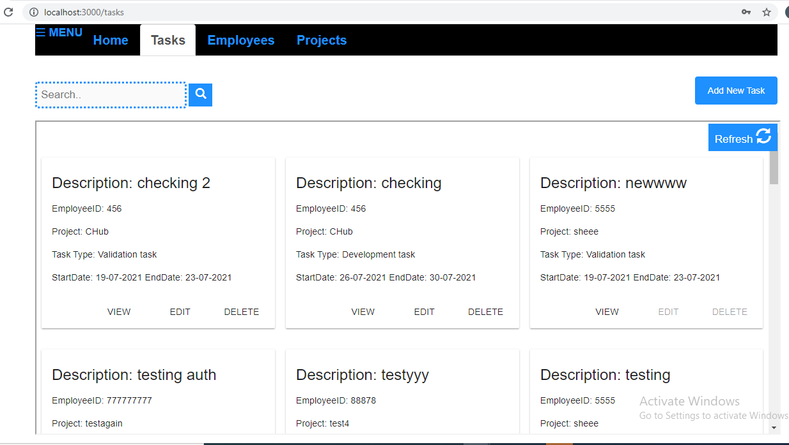

# ProjectsTracker

<!-- PROJECT LOGO -->
<br />
<p align="center">
  <p align="center">
    Easiest way to manage projects and tasks of team.
  </p>
</p>

<!-- TABLE OF CONTENTS -->
<details open="open">
  <summary>Table of Contents</summary>
  <ol>
    <li>
      <a href="#about-the-project">About The Project</a>
      <ul>
        <li><a href="#built-with">Built With</a></li>
      </ul>
    </li>
    <li>
      <a href="#getting-started">Getting Started</a>
      <ul>
        <li><a href="#prerequisites">Prerequisites</a></li>
        <li><a href="#installation">Installation</a></li>
      </ul>
    </li>
    <li><a href="#contact">Contact</a></li>
  </ol>
</details>


<!-- ABOUT THE PROJECT -->
## About The Project



Manage all your team's work in one place and improve accountability.
Facing difficulty in figuring out what tasks your team is doing in different projects? Then you need one solution to check all your teams members updates!
Here's why:
* Keep all projects,respective employees and their tasks in one place
* Let team members create,edit or delete tasks
* You can check all your projects and employee details.
* Easy access from mobile devices too.

### Built With

This section should list any major frameworks that you built your project using. Leave any add-ons/plugins for the acknowledgements section. Here are a few examples.
* [Mongoose (Object Modeling of MongoDB)](https://mongoosejs.com)
* [ExpressJs](https://expressjs.com)
* [AngularJs](https://angularjs.org)
* [NodeJs](https://nodejs.org/en)
* [Bootstrap](https://getbootstrap.com)


<!-- GETTING STARTED -->
## Getting Started

To get a local copy up and running follow these simple example steps.

### Prerequisites


- git - [Installation guide](https://www.linode.com/docs/development/version-control/how-to-install-git-on-linux-mac-and-windows/) .
- node.js - [Download page](https://nodejs.org/en/download/) .
- npm - comes with node or download yarn - [Download page](https://yarnpkg.com/lang/en/docs/install) .
- mongodb - [Download page](https://www.mongodb.com/download-center/community) .

### Installation

1. Clone the repo
   ```sh
   git clone https://github.com/SheetalBhyravajosula/ProjectsTracker.git
   ```
2. Install NPM packages
   ```sh
   npm install
   ```
3. Npm start
   ```sh
   npm start
   ```
   
<!-- CONTACT -->
## Contact

Project Link: [https://github.com/your_username/repo_name](https://github.com/SheetalBhyravajosula/ProjectsTracker)
